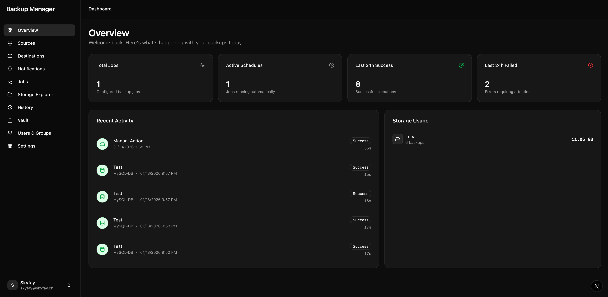

# Database Backup Manager

> **⚠️ Work in Progress**: This project is currently under active development. There is no stable release available yet. Use at your own risk.
> Check out [TODO.md](TODO.md) to see the roadmap and pending tasks.

> **Note**: This project is primarily developed on GitLab. This GitHub repository is a mirror.
> **Main Repository**: [https://gitlab.com/Skyfay/database-backup-manager](https://gitlab.com/Skyfay/database-backup-manager)

A robust, self-hosted solution for automating database backups. Manage sources, destinations, and backup schedules through a modern web interface.

## 🚀 Features

- **Multi-Database Support**: Backup **MySQL**, **PostgreSQL**, and **MongoDB**. (Additional databases planned)
- **Flexible Storage**: Store backups on **Local Filesystem**. (S3, Cloud Providers, and FTP coming soon)
- **Automated Scheduling**: Configure cron-based backup schedules for your jobs.
- **Notifications**: Get alerts via **Discord** or **Email** when backups succeed or fail.
- **Restore & Management**: Browse backup history, view logs, and restore databases directly from the UI.
- **Modern Dashboard**: Built with Next.js 16, Shadcn UI, and Tailwind CSS.
- **Secure**: Validation for database connections and credential management.

## � Preview

| Dashboard | Configuration |
|:---:|:---:|
|  |  |

| Storage Explorer |
|:---:|
|  |

## �🛠️ Tech Stack

- **Framework**: [Next.js 16](https://nextjs.org) (App Router)
- **Database**: SQLite (via Prisma ORM) for application state
- **UI Components**: [shadcn/ui](https://ui.shadcn.com)
- **Styling**: Tailwind CSS
- **Scheduler**: Custom Node-based scheduler

## 📦 Getting Started

### Prerequisites

- Node.js (v18+)
- Package manager (`pnpm`)
- Docker (optional, for running test databases)

### Installation

1. **Clone the repository**
   ```bash
   git clone https://gitlab.com/Skyfay/database-backup-manager.git
   cd database-backup-manager
   ```

2. **Install dependencies**
   ```bash
   pnpm install
   ```

3. **Configure Environment**
   Set up your `.env` file containing your database configuration and app secrets.
   ```bash
   # Example
   DATABASE_URL="file:./dev.db"

   # Better Auth Configuration
   BETTER_AUTH_SECRET="your-super-secret-key-here"
   BETTER_AUTH_URL="http://localhost:3000" # Set to your domain in production
   ```

   > **Tip**: You can generate a secure secret using `openssl`:
   > ```bash
   > openssl rand -base64 32
   > ```

4. **Initialize Database**
   Push the schema to your local database:
   ```bash
   npx prisma db push
   npx prisma generate
   ```

## 👨‍💻 Development

Start the development server:

```bash
pnpm dev
```

Open [http://localhost:3000/dashboard](http://localhost:3000/dashboard) with your browser to see the dashboard.

## 🐳 Testing Infrastructure

To spin up test instances of MySQL, Postgres, and MongoDB for development:

```bash
docker-compose -f docker-compose.test.yml up -d
```

## 📝 License

[MIT](LICENSE)
